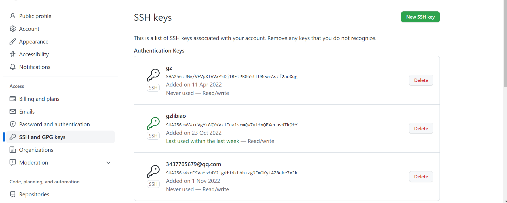

# git 初始化 配置

```
1、在要推送的内容里面右键选择 git bash here

2、输入 git init 初始化仓库, 本地会生成一个 .git 文件夹

3、然后输入 git remote add origin https://gitee.com/仓库

4、使用 git pull origin master 命令将码云的仓库 pull 到本地

5、git add . (别忘记.)

6、git commit -m '描述新添加的文件内容'

7、git push origin master 将本地仓库推送到远程仓库

```

### 出错

```

1 使用如下命令
git pull —rebase origin master

2 然后再进行上传:

git push -u origin master

```

## 已有代码 删.git

```

修改仓库地址:git remote set-url origin https://gitee.com/gz_lib/git

2 然后再进行上传:

git push -u origin master

```

### 设置 git 全局信息设置

```

git config --global --list
git config --global user.name xxx
git config --global user.email xxx

```

### 重置提交仓库地址

```

git remote set-url origin <newurl>

```

### 推送

```

git add .
git commit -m"x"
git push
git pull //保持本地仓库和远程仓库的同步

```

### 分支管理

```

git checkout -b 01nav //新建分支并切换分支
git branch //查看分支
git push origin 01nav //推送分支到远程
git checkout master //切换分支
git merge 01nav //合并分支

```

### 版本回退

```

git log //打印日志信息
git reflog //打印日志
git reset --hard xxxx //版本回退

```

### 清缓存

```

git rm -r --cached .

```

### 设置 git commit 时不忽略大小写

```

git config core.ignorecase false

```

### 设置 ssh key

```shell
  ssh-keygen -t rsa -C "3437705679@qq.com"
```


