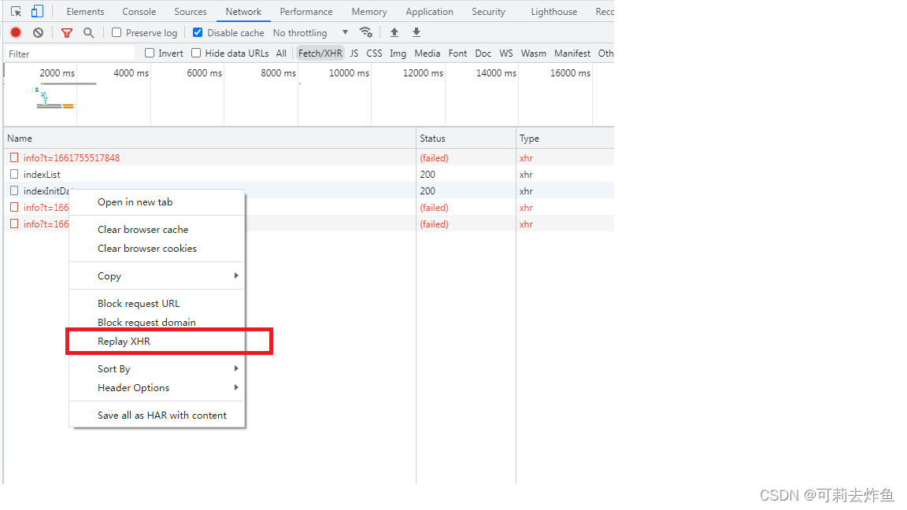
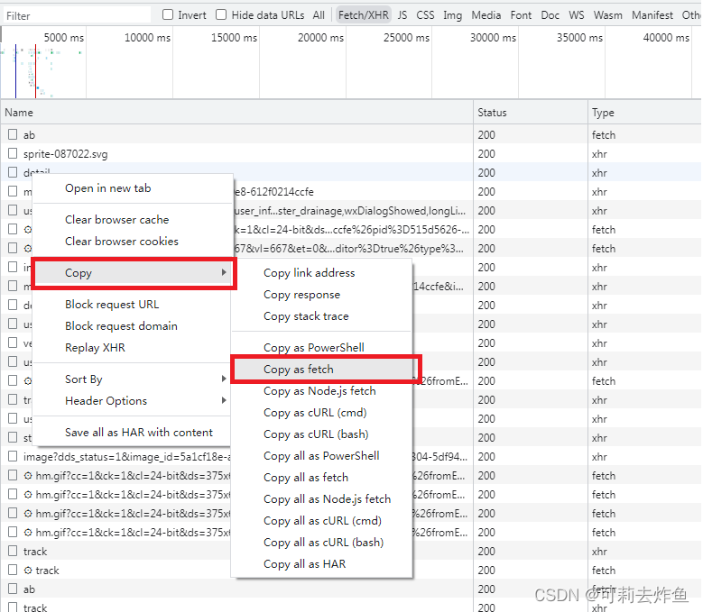
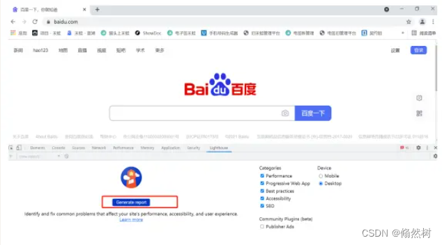

# google调试技巧

## 获取网页图片的base64
在开发者工具里打开源代码模式 source 选择图片 找到右边图片显示区 以数据uri格式复制图片

## 网络请求过滤
netword fetch/xhr

## 请求重发
netword 请求 右键 replay xhr

## 修改请求参数 copy as fetch


## 快速选中 查看元素


## 快速选中某些元素


## lighthouse 生成网站报告
先访问需要评估的网站，比如 http://www.baidu.com，然后点击灯塔按钮，选择 generate report 即可


### Lighthouse 会衡量以下 Metrics 性能指标项：

首次内容绘制（First Contentful Paint）。即浏览器首次将任意内容（如文字、图像、canvas 等）绘制到屏幕上的时间点。

首次有效绘制（First Meaningful Paint）。衡量了用户感知页面的主要内容（primary content）可见的时间。对于不同的站点，首要内容是不同的，例如：对于博客文章，标题及首屏文字是首要内容，而对于购物网站来说，图片也会变得很重要。

首次 CPU 空闲（First CPU Idle）。即页面首次能够对输入做出反应的时间点，其出现时机往往在首次有效绘制完成之后。该指标目前仍处于实验阶段。

可交互时间（Time to Interactive）。指的是所有的页面内容都已经成功加载，且能够快速地对用户的操作做出反应的时间点。该指标目前仍处于实验阶段。

速度指标（Speed Index）。衡量了首屏可见内容绘制在屏幕上的速度。在首次加载页面的过程中尽量展现更多的内容，往往能给用户带来更好的体验，所以速度指标的值约小越好。

输入延迟估值（Estimated Input Latency）。这个指标衡量了页面对用户输入行为的反应速度，其基准值应低于 50ms。
Metrics 部分的指标项会直接影响分数，可以作为我们的主要参考点。


### lighthouse 总结
```
Num.1 减少未使用的 JavaScript
Remove unused JavaScript
请减少未使用的 JavaScript，并等到需要使用时再加载脚本，以减少网络活动耗用的字节数
	
Num.2 采用新一代格式提供图片
Serve images in modern formats
WebP 和 AVIF 等图片格式的压缩效果通常优于 PNG 或 JPEG，因而下载速度更快，消耗的数据流量更少
	
Num.3 适当调整图片大小
Properly size images
提供大小合适的图片可节省移动数据网络流量并缩短加载用时
	
Num.4 推迟加载屏幕外图片
Defer offscreen images
建议您在所有关键资源加载完毕后推迟加载屏幕外图片和处于隐藏状态的图片，从而缩短可交互前的耗时
'/docs5 移除阻塞渲染的资源
Eliminate render-blocking resources
资源阻止了系统对您网页的首次渲染。建议以内嵌方式提供关键的 JS/CSS，并推迟提供所有非关键的 JS/样式
	
Num.6 减少未使用的 CSS
Remove unused CSS
请从样式表中减少未使用的规则，并延迟加载首屏内容未用到的 CSS，以减少网络活动耗用的字节数
	
Num.7 使用视频格式提供动画内容
Use video formats for animated content
使用大型 GIF 提供动画内容会导致效率低下。建议您改用 MPEG4/WebM 视频（来提供动画）和 PNG/WebP（来提供静态图片）以减少网络活动消耗的字节数
	
Num.8 预先连接到必要的来源
Preconnect to required origins
建议添加 preconnect 或 dns-prefetch 资源提示，以尽早与重要的第三方来源建立连接
	
Num.9 应避免向新型浏览器提供旧版 JavaScript
Deploying ES2015+ Code in Production Today
Polyfill 和 transform 让旧版浏览器能够使用新的 JavaScript 功能。不过，其中的很多函数对新型浏览器而言并非必需。对于打包的 JavaScript，请采用现代脚本部署策略，以便利用 module/nomodule 功能检测机制来减少传送到新型浏览器的代码量，同时保留对旧版浏览器的支持
	
Num.10 确保文本在网页字体加载期间保持可见状态
Ensure text remains visible during webfont load
利用 font-display 这项 CSS 功能，确保文本在网页字体加载期间始终对用户可见
	
Num.11 未使用被动式监听器来提高滚动性能
Use passive listeners to improve scrolling performance
建议您将触摸和滚轮事件监听器标记为 passive，以提高页面的滚动性能,passive 不会对事件的默认行为说 no
	
Num.12 图片元素没有明确的 width 和 height
请为图片元素设置明确的宽度值和高度值，以减少布局偏移并改善 CLS
	
Num.13 注册“unload”事件监听器
Legacy lifecycle APIs to avoid
unload 事件不会可靠地触发，而且监听该事件可能会妨碍系统实施“往返缓存”之类的浏览器优化策略。建议您改用 pagehide 或 visibilitychange 事件
	
Num.14 最大限度地减少主线程工作
Minimize main thread work
建议您减少为解析、编译和执行 JS 而花费的时间。您可能会发现，提供较小的 JS 负载有助于实现此目标
	
Num.15 采用高效的缓存策略提供静态资源
Serve static assets with an efficient cache policy
延长缓存期限可加快重访您网页的速度
	
Num.16 缩短 JavaScript 执行用时
Reduce JavaScript execution time
建议您减少为解析、编译和执行 JS 而花费的时间。您可能会发现，提供较小的 JS 负载有助于实现此目标
	
Num.17 避免链接关键请求
Avoid chaining critical requests
下面的关键请求链显示了以高优先级加载的资源。请考虑缩短链长、缩减资源的下载文件大小，或者推迟下载不必要的资源，从而提高网页加载速度
	
Num.18 请保持较低的请求数量和较小的传输大小
Use Lighthouse for performance budgets
performancebudget
若要设置页面资源数量和大小的预算，请添加 budget.json 文件
	
Num.19 最大内容渲染时间元素
Largest Contentful Paint
这是此视口内渲染的最大内容元素
	
Num.20 请避免出现大幅度的布局偏移
这些 DOM 元素对该网页的 CLS 影响最大
	
Num.21 应避免出现长时间运行的主线程任务
Are long JavaScript tasks delaying your Time to Interactive?
列出了主线程中运行时间最长的任务，有助于识别出导致输入延迟的最主要原因
	
Num.22 避免使用未合成的动画
Avoid non-composited animations
未合成的动画可能会卡顿并增加 CLS
	
Num.23 缩减 CSS
Minify CSS
缩减 CSS 文件大小可缩减网络负载规模
	
Num.24 缩减 JavaScript
Minify JavaScript
如果缩减 JavaScript 文件大小，则既能缩减负载规模，又能缩短脚本解析用时
	
Num.25 对图片进行高效编码
Efficiently encode images
如果图片经过了优化，则加载速度会更快，且消耗的移动数据网络流量会更少
	
Num.26 启用文本压缩
Enable text compression
对于文本资源，应先压缩（gzip、deflate 或 brotli），然后再提供，以最大限度地减少网络活动消耗的字节总数
	
Num.27 初始服务器响应用时较短
Reduce server response times (TTFB)
请确保服务器响应主文档的用时较短，因为这会影响到所有其他请求的响应时间
	
Num.28 避免多次网页重定向
Avoid multiple page redirects
重定向会在网页可加载前引入更多延迟
	
Num.29 预加载关键请求
Preload key requests
建议使用 来优先提取当前在网页加载后期请求的资源
	
Num.30 使用 HTTP/2
Does not use HTTP/2 for all of its resources
HTTP/2 提供了许多优于 HTTP/1.1 的益处，包括二进制标头和多路复用
	
Num.31 请移除 JavaScript 软件包中的重复模块
从软件包中移除重复的大型 JavaScript 模块可减少网络传输时不必要的流量消耗
	
Num.32 预加载 LCP 元素所用图片
优化 Largest Contentful Paint 最大内容绘制
请预加载 Largest Contentful Paint (LCP) 元素所用的图片，以缩短您的 LCP 用时
	
Num.33 避免网络负载过大
Avoid enormous network payloads
网络负载过大不仅会让用户付出真金白银，还极有可能会延长加载用时
	
Num.34 避免 DOM 规模过大
Avoid an excessive DOM size
大型 DOM 会增加内存使用量、导致样式计算用时延长，并产生高昂的布局重排成本
	
Num.35 User Timing 标记和测量结果
User Timing marks and measures
建议使用 User Timing API 检测您的应用，从而衡量应用在关键用户体验中的实际性能
	
Num.36 尽量减少第三方使用
Loading Third-Party JavaScript
第三方代码可能会显著影响加载性能。请限制冗余第三方提供商的数量，并尝试在页面完成主要加载后再加载第三方代码
	
Num.37 使用 Facade 延迟加载第三方资源
Lazy load third-party resources with facades
您可以延迟加载某些第三方嵌入代码。不妨考虑使用 Facade 替换这些代码，直到您需要使用它们为止
	
Num.38 Largest Contentful Paint 所对应的图片未被延迟加载
The performance effects of too much lazy-loading
被延迟加载的首屏图片会在页面生命周期内的较晚时间呈现，这可能会致使系统延迟渲染最大内容元素
	
Num.39 请勿使用 document.write()
Uses document.write()
对于连接速度较慢的用户，通过 document.write() 动态注入的外部脚本可将网页加载延迟数十秒
	
Num.40 具有包含 width 或 initial-scale 的 标记
Does not have a tag with width or initial-scale
```