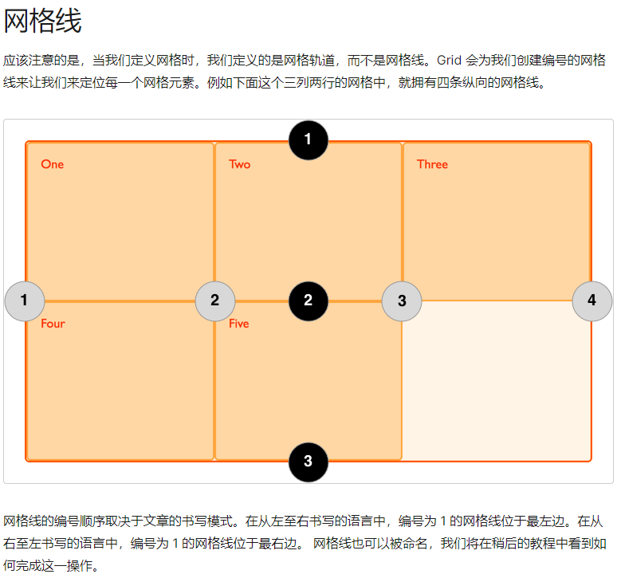

# 布局

## flex
居中
```css
.flex{
  display:flex;
  justify-content:center;
  align-items:center;
}
```

设置三列

```css
.flex {
  display: flex;
}
.item{
  flex:1; // grow shrink basis
}
```

根据内容选择大小
```css
.flex{
  display:flex;
}
.item{
  flex:auto;
}
```
### align-items 和 align-content
flex 容器不设置高度并且子项只有一行时，align-content 属性是不起作用的。

## grid

设置三列

```css
.grid {
  display: grid;
  grid-template-columns: 1fr 1fr 1fr;
}
```

自动填充子容器宽度 最小宽度80px (最后一列居左)

```css
.grid {
  display: grid;
  grid-template-columns: repeat(auto-fill, minmax(80px, 1fr));
}
```

子容器出现在固定位置

```css
#garden {
  display: grid;
  grid-template-columns: 20% 20% 20% 20% 20%; /* grid-template-columns: repeat(5,20%) */
  grid-template-rows: 20% 20% 20% 20% 20%;
  
}

#box {
  grid-column-start: 3;
  grid-row-start: 3;
  grid-column-end: 4;
  grid-row-end: 7;
}
```

间隙
```css
.grid{
  grid-column-gap、grid-row-gap、grid-gap（前俩的简写）
}
```

### 容器属性
grid-template-areas:'lt ct rt' 'lm cm rm' 'lb cb rb' 和 grid-area
grid: 行、列、以及行列宽高、间距属性的简写
grid-auto-columns:50px 设置默认列的宽度，好像没啥用？因为我们通常用 grid-template-columns 来定义列的一些配置信息（已经指定了列的宽度，这时候用 grid-auto-columns 是不生效的）
grid-auto-rows:50px 设置默认行的高度
grid-auto-flow:[row|column|dense|row dense|column dense] 控制网格元素排列方式
row: 也是默认值，增加行的方式继续往下排列 (纵向)
column: 网格元素排列方式是列 (横向)
dense； 简单理解就是 宽度是 auto 的

grid-column-gap
列的间距（也可以写作 column-gap ）
grid-row-gap
行的间距（也可以写作 row-gap ）
gap (grid-gap)
列、行的间距简写（同样，个人不太提倡使用简写方式）

### 子容器属性

grid-area: 合并行、列那几个属性的简写 grid-row-start、grid-column-start、grid-row-end、grid-column-end
grid-column
列合并两个属性的简写（grid-column-start、grid-column-end），中间使用 / 分割开
grid-column: 1 / 3;
grid-row
行合并两个属性的简写（grid-row-start、grid-row-end）用法同上



## 媒体查询
```css
@media screen and (min-width:300px){
  // 超出300像素屏幕
}

@media screen and (max-width:300px){
  // 300像素屏幕以内
}
```

## 文字溢出隐藏
```css
.ellipsis{
  overflow: hidden;
  text-overflow: ellipsis;
  white-space: nowrap;
}
```

## 无影响触发bfc
display为inline-block, table-cell, table-caption, flex,inline-flex
overflow:overflow
